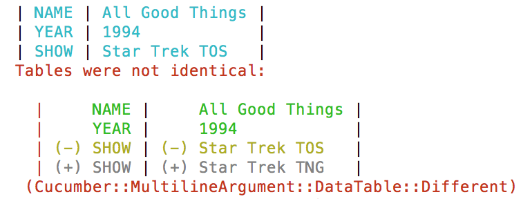
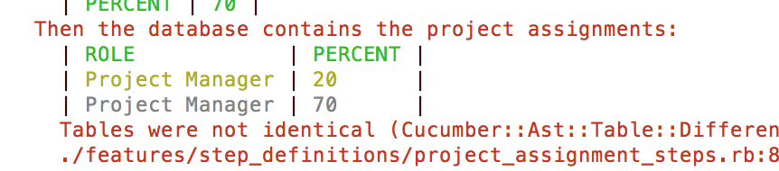

[](https://circleci.com/gh/Originate/active_cucumber)
[](https://codeclimate.com/github/Originate/active_cucumber)
[](https://gemnasium.com/Originate/active_cucumber)
[](https://coveralls.io/github/Originate/active_cucumber?branch=kg-coveralls)

High-level Cucumber helpers for performing
[ActiveRecord](http://guides.rubyonrails.org/active_record_basics.html)-based
database operations using Cucumber tables in tests.

## Installation

- add `gem 'active_cucumber'` to your Gemfile
- run `bundle install`
- make sure you have your
  [FactoryBot factories](https://github.com/thoughtbot/factory_bot) set up and
  loaded

## Creating database records

ActiveCucumber allows to create ActiveRecord objects from data in Cucumber
tables using [FactoryBot factories](https://github.com/thoughtbot/factory_bot).

Let's assume we have an application that stores TV shows and their episodes.

### Creating simple fields

Simple fields works out of the box. Let's say our tests contain this Cucumber
table:

```cucumber
Given the episodes:
  | NAME                  |
  | Encounter at Farpoint |
  | All Good Things       |
```

ActiveCucumber makes it trivially easy to implement this step:

```ruby
Given(/^the episodes:$/) do |table|
  ActiveCucumber.create_many Episode, table
end
```

### Transforming values

Let's say our data model also contains a `Series` class (an episode belongs to a
series, and a series has many episodes). We want to also define (and if
necessary create) the series that an episode belongs to:

```cucumber
Given the episodes:
  | SERIES        | NAME                  |
  | Star Trek TNG | Encounter at Farpoint |
  | Star Trek TNG | All Good Things       |
```

ActiveCucumber doesn't require custom step definitions here. To make this work,
tell ActiveCucumber how to convert particular Cucumber table fields into
ActiveRecord attributes via a `Creator` class:

```ruby
class EpisodeCreator < ActiveCucumber::Creator

  def value_for_series series_name
    Series.find_by(name: series_name) || FactoryBot.create(:series, name: series_name)
  end

end
```

ActiveCucumber automatically uses classes named `<class name>Creator` as creator
classes for the respective class. This class must have methods named
`value_for_<attribute name>`. They receive the value of the respective attribute
in the Cucumber table (a string), and return whatever value should be assigned
to that attribute on the ActiveRecord instance.

### Other columns

Cucumber tables can contain columns that provide other test data, and don't
correspond to attributes on the created object.

For example, let's say series belong to a `Genre` class that specifies the genre
that the series is in.

```cucumber
Given the episodes:
  | GENRE           | SERIES              | NAME                    |
  | Science Fiction | Star Trek TNG       | Encounter at Farpoint   |
  | Comedy          | The Big Bang Theory | The Big Bran Hypothesis |
```

Implementing this with Creators is simple:

Creators decorate the data structure that is sent to FactoryBot to create the
record. This means `self` inside creator methods behaves like a Hash that is
pre-populated with the Cucumber table data. You can modify this hash, use other
field values, add or remove fields, or store instance variables to be used
later.

```ruby
class EpisodeCreator < ActiveCucumber::Creator

  def value_for_genre genre_name
    @genre = Genre.find_by(name: genre_name) || FactoryBot.create(:genre, name: genre_name)
    delete :genre
  end

  def value_for_series series_name
    Series.find_by(name: series_name) || FactoryBot.create(:series, name: series_name, genre: @genre)
  end

end
```

### Context values

You can provide extra values to ActiveCucumber that are available as instance
variables on your creators.

Let's say our system has subscriptions for series, and we want to be able to use
the currently logged in user in them:

```cucumber
Given the subscriptions:
  | SUBSCRIBER | SHOW          |
  | me         | Star Trek TNG |
```

The currently logged in user can be provided to ActiveCucumber using the
`context` parameter:

```ruby
Given(/^the subscriptions:$/) do |table|
  ActiveCucumber.create_many Subscription, table, context: { logged_in_user: @current_user }
end
```

In the Creator, the context is available as instance variables:

```ruby
class SubscriptionCreator < ActiveCucumber::Creator

  def value_for_subscriber subscriber_name
    subscriber_name == 'me' ? @logged_in_user : subscriber_name
  end

end
```

### Retrieving record attributes

If you want to create the database record yourself, you can have ActiveCucumber
parse a Cucumber table into an attributes hash by calling

```ruby
ActiveCucumber.attributes_for <class>, table
```

with a vertical Cucumber table.

## Verifying database records

ActiveCucumber allows to compare ActiveRecord objects against Cucumber tables,
with the differences visualized intuitively as a Cucumber table diff. Only the
attributes provided in the table are compared, the ones not listed are ignored.

### diff_one!



`ActiveCucumber.diff_one!` compares the given ActiveRecord entry with the given
_vertical_ Cucumber table. These tables have their headers on the left side, and
are used to describe a single record in greater detail.

```cucumber
When loading the last Star Trek TNG episode
Then it returns this episode:
  | SHOW | Star Trek TNG   |
  | NAME | All Good Things |
  | YEAR | 1994            |
```

The `Then` step is easy to implement with ActiveCucumber:

```ruby
Then /^it returns this episode:$/ do |table|
  # @episode contains one loaded entry
  ActiveCucumber.diff_one! @episode, table
end
```

### diff_all!



`ActiveCucumber.diff_all!` verifies that the given _horizontal_ Cucumber table
describes all existing database entries of the given class. Horizontal Cucumber
tables have their headers on top, and define several records at once:

```cucumber
When I run the importer script with parameter "count=3"
Then the database contains these episodes:
  | SHOW          | NAME                  | YEAR |
  | Star Trek TNG | Encounter at Farpoint | 1987 |
  | Star Trek TNG | The Nth Degree        | 1991 |
  | Star Trek TNG | All Good Things       | 1994 |
```

The last step would be implemented as:

```ruby
Then /^Then the database contains these episodes:$/ do |table|
  ActiveCucumber.diff_all! Episode, table
end
```

The Cucumber table should list the entries sorted by `created_at` timestamp.

### Cucumberators

ActiveCucumber converts the database records into a data table and matches it
against the given Cucumber table.

By default, all attributes are converted into a String. It is possible to
customize this conversion step by creating a _Cucumberator_ (short for Cucumber
Decorator). This class decorates an ActiveRecord instance, and defines
converters for attribute values into the format used in the Cucumber table.

```ruby
class EpisodeCucumberator < Cucumberator

  # In the SHOW column, print the name of the associated show object,
  # truncated to 10 characters
  def value_of_show
    show.name.truncate 10
  end

end
```

ActiveCucumber automatically finds and uses these Cucumberators if this naming
convention is followed.
